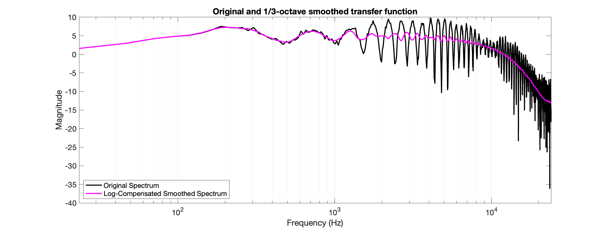
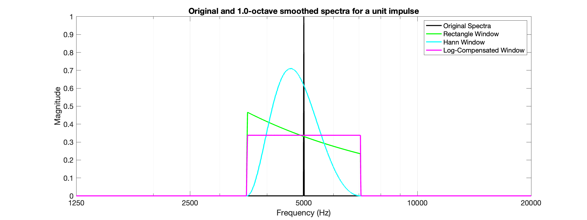

# fractionalOctaveSmoothing
Apply 1/n fractional octave smoothing to a spectrum, transfer function, or frequency response for plotting.

Log-compensated windowing to preserve log-frequency symmetry is implemented from:

[Tylka, J.G., Boren, B.B. and Choueiri, E.Y., 2017. A Generalized Method for Fractional-Octave Smoothing of Transfer Functions that Preserves Log-Frequency Symmetry. Journal of the Audio Engineering Society, 65(3), pp.239-245.](https://aes2.org/publications/elibrary-page/?id=18558)

Syntax:

```
[smoothSpectra, binFreqs] = spectrumOctaveSmoothing(spectra, nfft, fs, bandsPerOctave, windowMethod);
```

# Examples

Example of a transfer function smoothed over 1/3rd octave bands.


Example of the log-frequency symmetry of the log-compensated window.



## License

This project is licensed under the [BSD 3-Clause License](LICENSE).